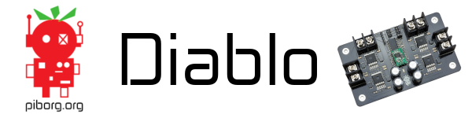

The [Diablo](https://www.piborg.org/diablo) is a dual channel motor controller for use with the Raspberry Pi, Arduino and other I2C capable SBCs.

It can be used with motors or steppers from 7V to 40V and is current limited to 55A per channel. Speed control is via PWM via I2C and the board has overheat protection, under voltage lockout and short circuit protection.

Shop: [Diablo](https://www.piborg.org/diablo)

# Quick Start Guide
Our complete Quick Start Guide will show you how to use the ```diabloGui.py``` and a one motor setup with a Raspberry Pi and Diablo.

# Install this Library
```
git clone https://github.com/piborg/diablo
cd diablo
chmod +x install.sh
./install.sh
```
This will install the Diablo library, the PiBorg Motor GUI and all dependencies needed to run the set of examples contained here.

# Diablo Library
```diablo.py``` contains the Diablo library with lots of functions describing how to use the Diablo. For a full breakdown of the API available please see the [Diablo API]().

# Examples
There are several examples in this repository to give you an idea of how to use the library with hardware.

## ```diabloGui.py```
Control a motor using Diablo and a GUI with two sliders. This is the example used in our [Quick Start Guide]().

## ```diabloJoystick.py```
Control a motor using Diablo, aPS4 controller and [Pygame](https://www.pygame.org/)

## ```diabloSequnce.py```
Driving two motors at a sequence of speeds using a Diablo.

## ```diabloStepper.py```
Driving a 4 wire stepper motor using a Diablo.

## ```diabloStepperSequnce.py```
Driving a 4 wire stepper motor using a sequnce of movements via a Diablo.

# Troubleshooting
For troubleshooting with the Diablo please refer to our [troubleshooting pages](https://www.piborg.org/blog/diablo-troubleshooting) and for further help please post questions on our [forum](http://forum.piborg.org/forum/diablo).

# Reporting Issues

If you find a bug with the Diablo code, please feel free to report it as an issue. When reporting issues with this library please supply:
- Raspberry Pi OS Version (Raspbian Stretch etc.)
- Hardware setup (number of motors, motor type, power source)
- Sample code
- Errors shown.

Please supply as much information as you can so we can replicate the bug locally. :)
